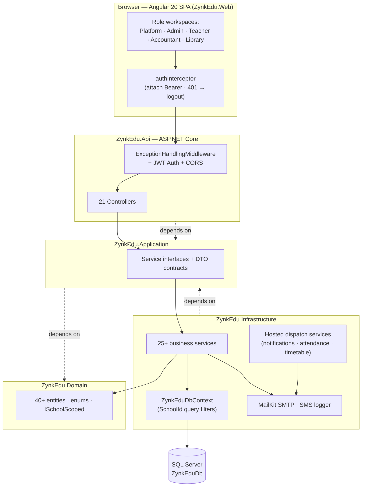
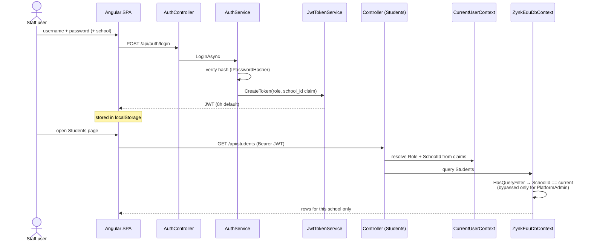
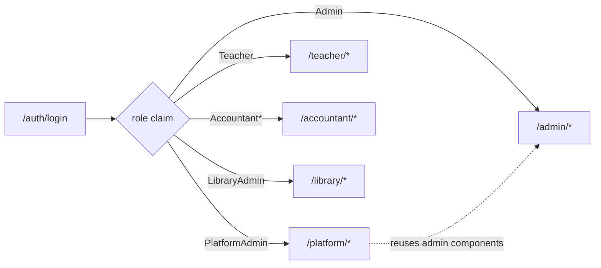
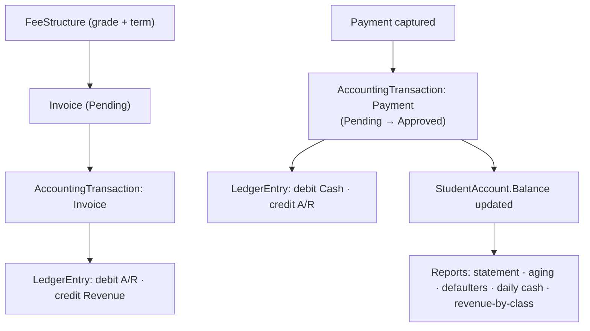

# ZynkEdu

ZynkEdu is a **multi-tenant school management platform** for platform administrators, school
administrators, accountants, teachers, and library staff. It combines a **.NET 10 ASP.NET Core
API** with an **Angular 20** single-page app, and isolates every school's data by `SchoolId` in a
shared database.

> **At a glance:** Clean Architecture backend (Domain → Application → Infrastructure → Api),
> JWT auth with role-based workspaces, EF Core multi-tenant query filters, and a PrimeNG/Tailwind
> Angular frontend. Modules: students, teachers, classes, subjects, assignments, timetable,
> grading, progression, attendance, results, notifications, accounting (double-entry), and library.

---

## Table of Contents

1. [System Architecture](#system-architecture)
2. [How It Works (Auth & Multi-Tenancy)](#how-it-works-auth--multi-tenancy)
3. [Roles & Workspaces](#roles--workspaces)
4. [Quick Start](#quick-start)
5. [Tech Stack](#tech-stack)
6. [Repository Layout](#repository-layout)
7. [Backend API Controllers](#backend-api-controllers)
8. [Modules](#modules)
9. [Database](#database)
10. [Configuration](#configuration)
11. [Before Production (Checklist)](#before-production-checklist)
12. [Project Status & Roadmap](#project-status--roadmap)
13. [Troubleshooting](#troubleshooting)

---

## System Architecture

ZynkEdu follows **Clean Architecture**: dependencies point inward, and the Domain layer has no
outward dependencies. The Angular SPA talks to the API over `/api`; the API resolves the current
user/tenant from the JWT and lets EF Core apply tenant filters automatically.



**Architecture highlights**

- **Clean Architecture** with inward dependency direction.
- **ASP.NET Core Web API** — attribute-routed controllers, `JsonStringEnumConverter`, ProblemDetails.
- **EF Core (code-first)** — Fluent API config, `HasQueryFilter` multi-tenant isolation, SQL Server
  provider with `EnableRetryOnFailure()`.
- **Angular 20** — standalone components, lazy-loaded route modules, layout shell, PrimeNG (Aura).
- **Auth** — JWT bearer; passwords hashed with ASP.NET Core `IPasswordHasher`; `[Authorize(Roles=…)]`.
- **Background services** — `NotificationDispatchHostedService`, `AttendanceDispatchHostedService`,
  `TimetableDispatchHostedService` for async delivery.

---

## How It Works (Auth & Multi-Tenancy)

Staff sign in with username + password (and school, for school-scoped users). The API issues a JWT
containing the role and a `school_id` claim. On every request, `CurrentUserContext` reads those
claims, and `ZynkEduDbContext` applies a query filter so school-scoped users only ever see their
own school's rows. Platform admins bypass the filter.



> **Tenant isolation** is enforced on 30+ `ISchoolScoped` entities via EF Core query filters keyed
> on the authenticated user's `SchoolId`. See
> [`ZynkEduDbContext.cs`](ZynkEdu.Infrastructure/Persistence/ZynkEduDbContext.cs) and
> [`CurrentUserContext.cs`](ZynkEdu.Infrastructure/Services/CurrentUserContext.cs).

---

## Roles & Workspaces

Each role lands in its own lazy-loaded workspace; `authGuard` + `workspaceGuard` keep users inside
the workspace their role allows. Platform admins can enter any workspace (the platform workspace
reuses the admin components with a `schoolId` context).



| Role | Scope | Key abilities |
|---|---|---|
| `PlatformAdmin` | All schools | Manage school registry, platform subject catalog, create/manage school admins; access every workspace |
| `Admin` | One school | Students, teachers, subjects, assignments, timetable, grading, progression, results, notifications, reports, attendance, calendar, accounting |
| `AccountantSuper` | School/platform finance | Full accounting control, approvals, reporting |
| `AccountantSenior` | School finance | Invoices, payments, adjustments, verification |
| `AccountantJunior` | School finance | Capture payments, view balances/statements |
| `Teacher` | Assigned classes | Enter results, mark attendance, view timetable, manage profile |
| `LibraryAdmin` | School library | Books, copies, loans, borrowers |

**Workspace routes** (lazy-loaded standalone components):

- **Platform** `/platform/*` — dashboard, schools, admins, attendance, students, teachers, classes, calendar, subjects, assignments, timetable, grading, progression, results, notifications, reports, accounting
- **Admin** `/admin/*` — dashboard, attendance, students, teachers, classes, subjects, assignments, timetable, grading, progression, results, notifications, calendar, reports, accounting, logs
- **Teacher** `/teacher/*` — dashboard, attendance, classes, results, subjects, timetable, profile, notifications
- **Accountant** `/accountant/*` — dashboard, students, payments, invoices, reports, analytics
- **Library** `/library/*` — dashboard, books, loans, users
- **Auth/account** — `/auth/login`, `/auth/access`, `/auth/error`, `/account/settings`

---

## Quick Start

### Prerequisites

| Tool | Version | Notes |
|---|---|---|
| .NET SDK | **10.0.x** (100+) | `dotnet --list-sdks` must show a 10.0.x |
| Node.js | **22.x LTS or 24.x** | Verified building on Node 24.13.0 / npm 11.9.0; 22.x LTS also supported |
| npm | 10.x+ | Bundled with Node |
| SQL Server | LocalDB / Express / Azure SQL | LocalDB ships with Visual Studio 2022+ |
| `dotnet-ef` | 10.x | Optional, for migrations: `dotnet tool install --global dotnet-ef` |

### 1. Build the backend

```bash
dotnet restore ZynkEdu.slnx
dotnet build ZynkEdu.slnx
```

> ⚠️ **Stop any running API instance first.** A running `ZynkEdu.Api` locks `ZynkEdu.Api.exe`, and
> the build will fail with `MSB3027 / MSB3021` (file in use). This is an environmental lock, not a
> code error.

### 2. Run the API

```bash
dotnet run --project ZynkEdu.Api/ZynkEdu.Api.csproj
```

API: `http://localhost:5000`. Swagger UI (Development): `http://localhost:5000/swagger`.
On startup the app applies pending EF migrations (retrying if LocalDB isn't ready yet) and ensures
the platform-admin account exists.

### 3. Run the frontend

```bash
cd ZynkEdu.Web
npm install
npm start
```

Angular dev server: `http://localhost:4200`, proxying `/api` → `http://localhost:5000` via
`proxy.conf.json`.

### 4. Tests & production build

```bash
dotnet test tests/ZynkEdu.Tests/ZynkEdu.Tests.csproj   # backend (stop the API first)
cd ZynkEdu.Web && npm run build                         # frontend production bundle
```

### First login

The platform admin is seeded from `Bootstrap:PlatformAdmin` in `appsettings.json`:

- Username: `platformadmin`
- Password: `ChangeMe123!` (development default — **change before any deployment**)

From the platform workspace, create schools (`/platform/schools`) and school admins
(`/platform/admins`); school admins then add teachers, students, subjects, classes, etc. The app
does **not** seed demo data — it starts with only the platform admin and a placeholder
`Platform Administration` school.

---

## Tech Stack

### Backend (.NET 10)

| Technology | Version | Package |
|---|---|---|
| Target Framework | net10.0 | – |
| ASP.NET Core | 10.0.x | `Microsoft.AspNetCore.App` |
| Entity Framework Core | 10.0.x | `Microsoft.EntityFrameworkCore(.SqlServer/.Design)` |
| JWT Auth | 10.0.x | `Microsoft.AspNetCore.Authentication.JwtBearer` |
| OpenAPI / Swagger | 10.x | `Swashbuckle.AspNetCore` |
| Email (SMTP/MIME) | 4.x | `MailKit` |

### Frontend (Angular 20)

| Technology | Version |
|---|---|
| Angular | 20.x |
| TypeScript | 5.8.x |
| PrimeNG / PrimeUIX Themes (Aura) | 20.x / 1.x |
| Tailwind CSS | 4.x |
| Chart.js | 4.x |
| jsPDF + autotable / xlsx | 4.x / 0.18.x |

### Testing

| Area | Stack |
|---|---|
| Backend | xUnit + Moq + `Microsoft.EntityFrameworkCore.Sqlite` (in-memory) + `Mvc.Testing` |
| Frontend | Karma + Jasmine |

---

## Repository Layout

- `ZynkEdu.Domain` — entities, enums, shared domain contracts (`ISchoolScoped`, 40+ entity types)
- `ZynkEdu.Application` — service interfaces, DTO contracts/records, abstractions
- `ZynkEdu.Infrastructure` — EF Core `DbContext` + migrations, auth (JWT, password hashing),
  bootstrap, messaging (SMTP/SMS), accounting/library services, background dispatch services
- `ZynkEdu.Api` — API host, 21 controllers, middleware, OpenAPI/Swagger, startup bootstrap
- `ZynkEdu.Web` — Angular 20 SPA (standalone components, role-based workspaces, PrimeNG + Tailwind)
- `tests/ZynkEdu.Tests` — xUnit service-level tests

`ZynkEdu.slnx` is the solution entry point.

---

## Backend API Controllers

| Controller | Route Prefix | Responsibility |
|---|---|---|
| `AuthController` | `/api/auth` | Login, list schools |
| `PlatformController` | `/api/platform` | Platform-level operations |
| `PlatformSubjectsController` | `/api/platform/subjects` | Platform subject catalog, import/publish |
| `PlatformAccountingController` | `/api/platform/accounting` | Platform-scoped accounting |
| `UsersController` | `/api/users` | Teacher/admin/library/accountant CRUD |
| `StudentsController` | `/api/students` | Student CRUD, status updates |
| `SubjectsController` | `/api/subjects` | School-scoped subject CRUD |
| `ClassesController` | `/api/classes` | School class CRUD |
| `TeacherAssignmentsController` | `/api/teacher-assignments` | Assignments, batch creation |
| `ResultsController` | `/api/results` | Result CRUD, approval, slip sending |
| `AttendanceController` | `/api/attendance` | Registers, daily summaries |
| `NotificationsController` | `/api/notifications` | Send/list notifications |
| `DashboardController` | `/api/dashboard` | Role-based dashboard stats |
| `AccountingController` | `/api/accounting` | Fees, invoices, payments, refunds, statements, reports |
| `AdminAccountingController` | `/api/admin/accounting` | Admin-scoped accounting |
| `AcademicCalendarController` | `/api/calendar` | Terms, calendar events |
| `TimetablesController` | `/api/timetables` | Slots, publications, dispatch |
| `GradingSchemesController` | `/api/grading` | Grading bands, defaults |
| `StudentLifecycleController` | `/api/student-lifecycle` | Progression runs, movements, enrollment |
| `LibraryController` | `/api/library` | Books, copies, loans, borrowers |
| `AuditLogsController` | `/api/audit-logs` | Recent audit log retrieval |

---

## Modules

### Accounting (double-entry)

School-scoped financial management. A fee structure drives invoices; invoices and payments post
typed transactions that write double-entry ledger lines and update the student account balance,
feeding all finance reports.



- **Entities:** `StudentAccount`, `AccountingTransaction`, `LedgerEntry`, `FeeStructure`, `Invoice`, `Payment`
- **Reports:** student statement (full/term), financial statements (income/balance sheet/cash flow),
  collection, aging, daily cash, revenue-by-class, defaulters

### Library

- **Entities:** `LibraryBook`, `LibraryBookCopy`, `LibraryLoan`
- Catalog with full metadata; copy management; loan lifecycle (issue/return/renew); overdue tracking;
  borrowers across students and teachers

### Academic modules

- **Subjects & assignments** — level-aware subjects (`ZGC Level`, `O'Level`, `A'Level`); teacher
  assignment validates that subject level matches class level; platform subject catalog with
  import/publish across schools.
- **Timetable** — per-school/per-term slots, publication workflow, automated dispatch to teachers.
- **Attendance** — daily registers, per-student status, daily summaries, guardian dispatch.
- **Results & grading** — per-student/subject/term results with approval workflow
  (Pending → Approved → Locked, with Reject/Reopen); configurable grading bands per level; result
  slip email dispatch with optional financial-statement PDF.
- **Student lifecycle** — promotion/demotion/transfer with run tracking and movement history; subject
  enrollment (single + bulk).
- **Notifications** — SMS/email delivery abstractions; background hosted services dispatch pending
  notifications, attendance reports, and timetables asynchronously.
- **Audit logging** — actor, action, entity type/ID, old/new values, and summary across entity types.

> Guardians are captured per student (`ParentEmail` / `ParentPhone` + a `Guardian` collection) and
> contacted through admin workflows, emailed reports, and notifications. There is no separate parent
> login portal.

---

## Database

- **Engine:** SQL Server 2019+ (LocalDB for dev, full SQL Server / Azure SQL for production)
- **LocalDB connection:** `Data Source=(localdb)\MSSQLLocalDB;Initial Catalog=ZynkEduDb;MultipleActiveResultSets=true;TrustServerCertificate=true;`
- **Migrations:** `ZynkEdu.Infrastructure/Persistence/Migrations/` — applied automatically on startup
- **Multi-tenancy:** shared database with `SchoolId` query filters on all `ISchoolScoped` entities
- **Core entities:** Schools, Users, Students, Guardians, Subjects, SchoolClasses, ClassSubjects,
  TeacherAssignments, Results, Attendance, Notifications, Timetable, AcademicTerms/Events,
  StudentAccounts, AccountingTransactions, LedgerEntries, FeeStructures, Invoices, Payments,
  StudentMovements, ProgressionRuns, SubjectEnrollments, GradingBands, AuditLogs,
  LibraryBooks/Copies/Loans

Update the database manually with:

```powershell
.\scripts\Update-Database.ps1
```
```bash
dotnet ef database update --project ZynkEdu.Infrastructure --startup-project ZynkEdu.Api
```

---

## Configuration

Backend config lives in `ZynkEdu.Api/appsettings.json` (overridden by `appsettings.Development.json`).

| Key | Description | Default |
|---|---|---|
| `ConnectionStrings:DefaultConnection` | SQL Server connection string | LocalDB → `ZynkEduDb` |
| `Jwt:Issuer` / `Jwt:Audience` | JWT issuer/audience | `ZynkEdu` |
| `Jwt:SigningKey` | HMAC signing key (**32+ chars in prod**) | dev placeholder |
| `Jwt:ExpirationMinutes` | Staff JWT lifetime | `480` (8h) |
| `Email:EmailHost` / `EmailPort` | SMTP host/port | `smtp.itanywhere.africa` / `587` |
| `Email:EmailUsername` / `EmailPassword` | SMTP credentials | **dev only — move to a secret store** |
| `Email:EnableSsl` / `TimeoutMilliseconds` / `MaxRetries` | SMTP behavior | `true` / `30000` / `3` |
| `Bootstrap:PlatformAdmin:Username` / `Password` | Seeded admin | `platformadmin` / `ChangeMe123!` |

---

## Before Production (Checklist)

> 🔴 **These are launch blockers.** The repository ships development-only secrets in
> `appsettings.json` that are visible in git history.

- [ ] **Rotate and externalize secrets.** Move `Jwt:SigningKey`, `Email:EmailPassword`, and the
      bootstrap admin password to **user-secrets (dev)** / **environment variables / Key Vault
      (prod)**. Rotate any credential that was ever committed.
- [ ] **Set a strong JWT signing key** (32+ random chars) — not the `development-…` default.
- [ ] **Change the default platform-admin password.**
- [ ] **Configure CORS for production origins** (currently hardcoded to `http://localhost:4200` in
      [`Program.cs`](ZynkEdu.Api/Program.cs)).
- [ ] **Enable HTTPS redirection + HSTS** (not currently configured).
- [ ] **Add rate limiting** (esp. on `/api/auth/login`) and a **`/health`** endpoint for the load
      balancer.
- [ ] Replace the logging-only SMS sender with a real provider implementation.

---

## Project Status & Roadmap

ZynkEdu's code compiles on both stacks and the core feature set is in place. Active hardening work
is tracked as a phased roadmap:

1. **Hygiene, docs & dead-code removal** *(this phase)* — untrack build artifacts, README + diagrams,
   remove retired parent-portal remnants and Sakai template demo pages.
2. **Security & production hardening** — externalize/rotate secrets, HTTPS+HSTS, configurable CORS,
   rate limiting, health checks.
3. **Correctness safety net** — tenant-isolation + API integration tests, transaction-rollback tests,
   global frontend HTTP error handling.
4. **Maintainability & performance** — split large services/components, de-duplicate PDF code,
   lazy-load heavy libraries, bundle budgets.
5. **CI/CD & ops** — build/test/lint pipeline for both stacks, coverage gates, container packaging.

**Known issues (pre-existing, to be addressed):** a small number of accounting tests currently fail
— financial-statement titles return enum names (`BalanceSheet`) instead of display labels
(`Balance Sheet`), an invoice-amendment number returns `null`, and the in-progress term-statement
test has a seed FK issue. These predate the documentation/cleanup work and are slated for the
correctness phase.

---

## Troubleshooting

- **Build fails with `MSB3027 / MSB3021` (file in use):** a running `ZynkEdu.Api` is locking the
  output EXE. Stop it and rebuild.
- **Startup migration/schema error after pulling changes:** stop any running API, then run
  `.\scripts\Update-Database.ps1` (or `dotnet ef database update`). Usually an out-of-date LocalDB
  schema or an API instance holding old assemblies.
- **LocalDB not reachable:** start it with `SqlLocalDB start MSSQLLocalDB`. The API retries up to 5
  times with backoff during startup bootstrap.

---

## Helpful Files

- [`ZynkEdu.Api/Program.cs`](ZynkEdu.Api/Program.cs)
- [`ZynkEdu.Api/appsettings.json`](ZynkEdu.Api/appsettings.json)
- [`ZynkEdu.Infrastructure/Persistence/ZynkEduDbContext.cs`](ZynkEdu.Infrastructure/Persistence/ZynkEduDbContext.cs)
- [`ZynkEdu.Infrastructure/ServiceCollectionExtensions.cs`](ZynkEdu.Infrastructure/ServiceCollectionExtensions.cs)
- [`ZynkEdu.Web/src/app.routes.ts`](ZynkEdu.Web/src/app.routes.ts)
- [`ZynkEdu.Web/src/app/core/auth/auth.service.ts`](ZynkEdu.Web/src/app/core/auth/auth.service.ts)
- [`ZynkEdu.Web/src/app/core/api/api.service.ts`](ZynkEdu.Web/src/app/core/api/api.service.ts)
